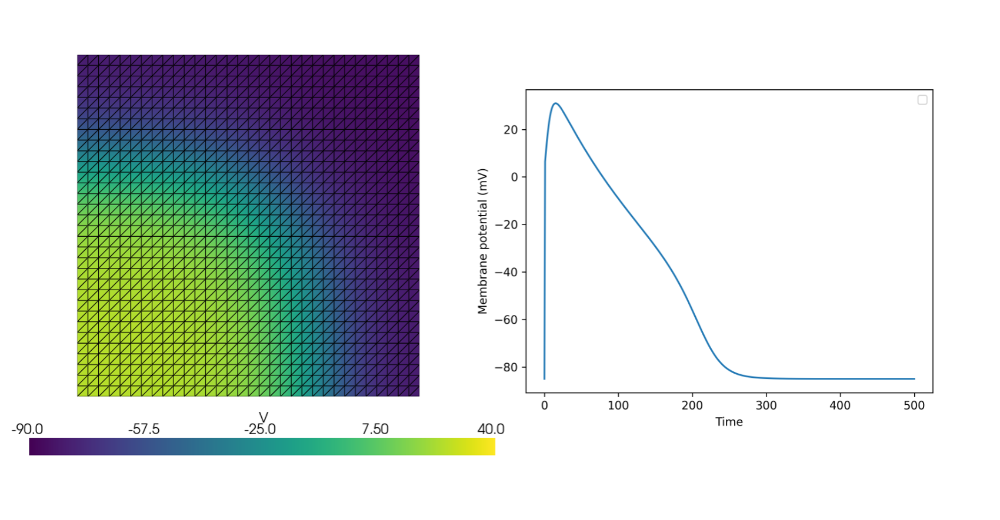

# Summary
`fenicsx-beat` is an open-source Python software package for simulating cardiac electrophysiology, built upon the FEniCSx finite element framework [@ORBi-bf72337a-a760-487c-84eb-292ea4cebe75]. It provides tools to solve the Monodomain model, a widely used model for electrical signal propagation in cardiac tissue, coupled with systems of ordinary differential equations (ODEs) that represent complex ionic models governing cell membrane dynamics. Designed for researchers in computational cardiology, `fenicsx-beat` leverages the high-performance capabilities of FEniCSx to enable efficient and scalable simulations of cardiac electrical activity on various computational platforms.


# Statement of need
Computational modeling plays an increasingly vital role in cardiac electrophysiology research, offering insights into mechanisms of heart rhythm disorders (arrhythmias), evaluating therapeutic strategies like drug effects or ablation, and paving the way towards personalized medicine and 'digital twin' concepts. Mathematical models, ranging from detailed ionic interactions at the subcellular level to electrical wave propagation at the tissue and organ level, allow for quantitative investigation of physiological and pathological conditions that are difficult or impossible to study experimentally.

The Bidomain model is often considered the most physiologically detailed representation of cardiac tissue electrophysiology, but its computational cost can be prohibitive for large-scale or long-duration simulations. The Monodomain model, a simplification valid under certain assumptions about tissue conductivity, offers a computationally less expensive alternative while still capturing essential propagation dynamics accurately in many scenarios, such as studies of activation sequences or basic arrhythmia mechanisms. Solving these models typically involves coupling the reaction-diffusion PDE (Monodomain or Bidomain) with a system of stiff ODEs describing the ionic currents across the cell membrane (the ionic model) [@sundnes2007computing].

The FEniCSx project provides a modern, powerful, and performant platform for solving PDEs using the finite element method, featuring a high-level Python interface for ease of use and a C++ backend for efficiency and scalability. There is a need for specialized cardiac simulation tools that integrate seamlessly with this evolving ecosystem. While related tools based on the legacy FEniCS library exist, such as `cbcbeat` [@Rognes2017] and the electro-mechanics solver `simcardems` [@Finsberg2023], `fenicsx-beat` specifically targets the FEniCSx platform, providing researchers already using FEniCSx with a dedicated and readily integrable tool for cardiac electrophysiology simulations based on the Monodomain model.


## Functionality
`fenicsx-beat` facilitates the simulation of electrical wave propagation in cardiac tissue by solving the Monodomain equation coupled with a system of ODEs representing a chosen ionic model. The core mathematical problem is a reaction-diffusion system:

$$
\chi (C_m \frac{\partial v}{\partial t} + I_{\text{ion}}  - I_{\text{stim}}) = \nabla \cdot (\sigma\nabla v)
$$

$$
\frac{\partial s}{\partial t} = f(s, v, t)
$$


where $v$ is the transmembrane potential, $s$ represents the state variables of the ionic model, $C_m$ is the membrane capacitance, $I_{\text{ion}}$ is the total ionic current, $I_{\text{stim}}$ is the applied stimulus current, $\sigma$ is the conductivity tensor, and $f(s, v, t)$ is the system of ODEs defining the ionic model. The Monodomain equation describes the diffusion of the transmembrane potential $v$ in the tissue, while the ODE system captures the dynamics of the ionic currents across the cell membrane. The coupling between these two components is essential for accurately simulating cardiac electrophysiology.

The software leverages the FEniCSx library for the spatial discretization of the PDE component using the finite element method. Variational forms are expressed using the Unified Form Language (UFL), and the software utilizes the high-performance assembly and solution capabilities of DOLFINx. This allows for simulations on complex geometries using various element types and supports parallel execution via MPI. DOLFINx interfaces with robust external libraries, notably PETSc, for scalable linear algebra operations and solvers.


## Illustrative example
The following minimal example demonstrates simulating the Monodomain model on a unit square domain using a modified FitzHugh-Nagumo model [@rogers1994collocation]. For simplicity we use the forward Euler method to solve the ODEs. However, in a real simulation, we would use `gotranx` [@Finsberg2024] to generate code for solving the ODEs (see more examples in the documentation).

The state variables are $s$ and $v$. The derivatives $\frac{ds}{dt}$ and $\frac{dv}{dt}$ are calculated, and then the forward Euler update rule is applied.

The equations for the derivatives are:

$$ \frac{ds}{dt} = b((v - v_{rest})-c_3 s) $$
$$ \frac{dv}{dt} = I + i_{app} $$

where

$$ I =  \left(\left(\frac{c_1}{v_{\mathrm{amp}}^2}\right) (v - v_{\mathrm{res}t})\right) (v - v_{th}) (v_{\mathrm{peak}} - v) - s \left(\frac{c_2}{v_{\mathrm{amp}}}\right) (v - v_{\mathrm{rest}})
$$

and the threshold voltage $v_{th}$ is defined as:

$$ v_{th} = v_{\mathrm{amp}} a + v_{rest} $$

The applied current $i_{app}(t)$ is defined as:

$$
i_{\mathrm{app}}(t) = \begin{cases} \mathrm{stim}_{\mathrm{amp}} & \text{if } \mathrm{stim}_{\mathrm{start}} < t < \mathrm{stim}_{\mathrm{start}} + \mathrm{stim}_{\mathrm{dur}} \\ 0 & \text{otherwise} \end{cases}.
$$

The following code snippet demonstrates the setup and execution of a simulation using `fenicsx-beat`:


```python
import shutil

import matplotlib.pyplot as plt
import numpy as np

from mpi4py import MPI
import dolfinx
import ufl

import beat

# MPI communicator
comm = MPI.COMM_WORLD
# Create mesh
mesh = dolfinx.mesh.create_unit_square(comm, 32, 32, dolfinx.cpp.mesh.CellType.triangle)
# Create a variable for time
time = dolfinx.fem.Constant(mesh, dolfinx.default_scalar_type(0.0))


# Define forward euler scheme for solving the ODEs
# This just needs to be a function that takes the current time, states, parameters and dt
# and returns the new states
def fitzhughnagumo_forward_euler(t, states, parameters, dt):
    s, v = states
    (
        c_1,
        c_2,
        c_3,
        a,
        b,
        v_amp,
        v_rest,
        v_peak,
        stim_amplitude,
        stim_duration,
        stim_start,
    ) = parameters
    i_app = np.where(
        np.logical_and(t > stim_start, t < stim_start + stim_duration),
        stim_amplitude,
        0,
    )
    values = np.zeros_like(states)

    ds_dt = b * ((v - v_rest) - c_3 * s )
    values[0] = s + ds_dt * dt

    v_th = v_amp * a + v_rest
    I = -s * (c_2 / v_amp) * (v - v_rest) + (
        ((c_1 / v_amp**2) * (v - v_rest)) * (v - v_th)
    ) * (-v + v_peak)
    dv_dt = I + i_app
    values[1] = v + dv_dt * dt
    return values


# Define space for the ODEs
ode_space = dolfinx.fem.functionspace(mesh, ("P", 1))

# Define parameters for the ODEs
a = 0.13
b = 0.013
c1 = 0.26
c2 = 0.1
c3 = 1.0
v_peak = 40.0
v_rest = -85.0
stim_amplitude = 100.0
stim_duration = 1
stim_start = 0.0

# Collect the parameter in a numpy array
parameters = np.array(
    [
        c1,
        c2,
        c3,
        a,
        b,
        v_peak - v_rest,
        v_rest,
        v_peak,
        stim_amplitude,
        stim_duration,
        stim_start,
    ],
    dtype=np.float64,
)

# Define the initial states
init_states = np.array([0.0, -85], dtype=np.float64)
# Specify the index of state for the membrane potential
# which will also inform the PDE solver later
v_index = 1

# We can also check that the solution of the ODE
# by solving a the ODE for a single cell
times = np.arange(0.0, 500.0, 0.1)
values = np.zeros((len(times), 2))
values[0, :] = np.array([0.0, -85.0])
for i, t in enumerate(times[1:]):
    values[i + 1, :] = fitzhughnagumo_forward_euler(t, values[i, :], parameters, dt=0.1)


fig, ax = plt.subplots()
ax.plot(times, values[:, v_index])
ax.set_xlabel("Time")
ax.set_ylabel("Membrane potential (mV)")
ax.legend()
fig.savefig("ode_solution.png", dpi=300)


# Now we set external stimulus to zero for ODE
parameters[-3] = 0.0

# and create stimulus for PDE
stim_expr = ufl.conditional(ufl.And(ufl.ge(time, 0.0), ufl.le(time, 0.5)), 600.0, 0.0)
stim_marker = 1
cells = dolfinx.mesh.locate_entities(
    mesh, mesh.topology.dim, lambda x: np.logical_and(x[0] <= 0.5, x[1] <= 0.5)
)
stim_tags = dolfinx.mesh.meshtags(
    mesh,
    mesh.topology.dim,
    cells,
    np.full(len(cells), stim_marker, dtype=np.int32),
)
dx = ufl.Measure("dx", domain=mesh, subdomain_data=stim_tags)
I_s = beat.Stimulus(expr=stim_expr, dZ=dx, marker=stim_marker)

# Next we create the ODE solver where we make sure to
# pass the variable for the membrane potential from the PDE
v_ode = dolfinx.fem.Function(ode_space)
ode = beat.odesolver.DolfinODESolver(
    v_ode=v_ode,
    fun=fitzhughnagumo_forward_euler,
    init_states=init_states,
    parameters=parameters,
    num_states=len(init_states),
    v_index=1,
)

# Create PDE model
pde = beat.MonodomainModel(time=time, mesh=mesh, M=0.001, I_s=I_s, dx=dx, v_ode=v_ode)

# Combine PDE and ODE solver
solver = beat.MonodomainSplittingSolver(pde=pde, ode=ode)

# Now we setup file for saving results
# First remove any existing files
shutil.rmtree("voltage.bp", ignore_errors=True)

vtx = dolfinx.io.VTXWriter(mesh.comm, "voltage.bp", [pde.state], engine="BP5")
vtx.write(0.0)

# Finally we run the simulation for 400 ms using a time step of 0.01 ms
T = 400.0
t = 0.0
dt = 0.01
i = 0
while t < T:
    v = solver.pde.state.x.array
    solver.step((t, t + dt))
    t += dt
    if i % 500 == 0:
        vtx.write(t)
    i += 1

vtx.close()
```




## Comparison with Other Software
The field of computational cardiac electrophysiology benefits from several open-source simulation packages. `fenicsx-beat` distinguishes itself by being built natively on the modern FEniCSx framework, targeting users who leverage this platform for its flexibility in solving PDEs with the finite element method.

Within the FEniCS ecosystem, `fenicsx-beat` can be seen as a successor or counterpart to `cbcbeat`, which provided similar Monodomain/Bidomain capabilities but was based on the legacy FEniCS library. Other FEniCS/FEniCSx-based tools focus on different physics: `simcardems` couples electrophysiology with solid mechanics, `pulse` [@Finsberg2019] focuses solely on cardiac mechanics, and `Ambit` [@Hirschvogel2024] is a newer multi-physics solver primarily for cardiac mechanics and fluid-structure interaction (FSI), although future electrophysiology capabilities are envisioned. `fenicsx-beat` provides the dedicated, up-to-date electrophysiology solver within this FEniCSx environment.

Compared to established standalone simulators like openCARP [@plank2021opencarp], `fenicsx-beat` offers tighter integration with FEniCSx libraries. openCARP is a powerful, widely used simulator with its own optimized C++ core and a dedicated Python workflow tool (carputils) for managing complex simulations.

Another prominent open-source package is Chaste (Cancer, Heart And Soft Tissue Environment) [@Cooper2020], a C++ library designed for a broad range of computational biology problems, including cardiac electrophysiology.

In summary, `fenicsx-beat` occupies a valuable niche by providing a modern, Python-interfaced, FEniCSx-native tool for Monodomain cardiac electrophysiology simulations. Its primary strength lies in its seamless integration with the FEniCSx platform, making it an attractive choice for researchers utilizing FEniCSx for multi-physics cardiac modeling.

# Acknowledgements
This work has been financially supported by Simula Research Laboratory and by the European Union’s Horizon 2020 research and innovation program (grant number: 101016496 (SimCardioTest)).

# References
